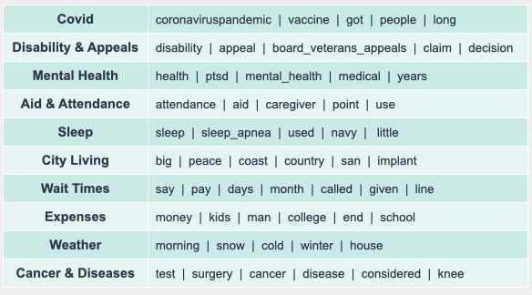
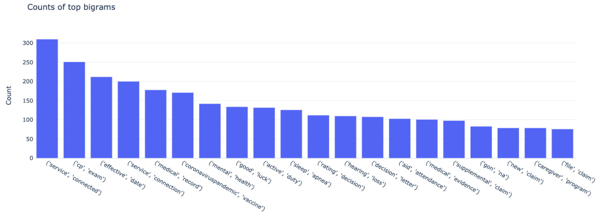
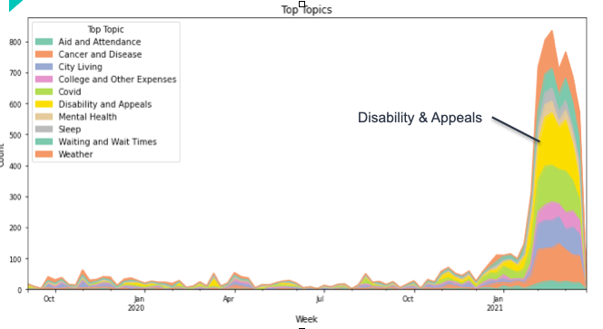
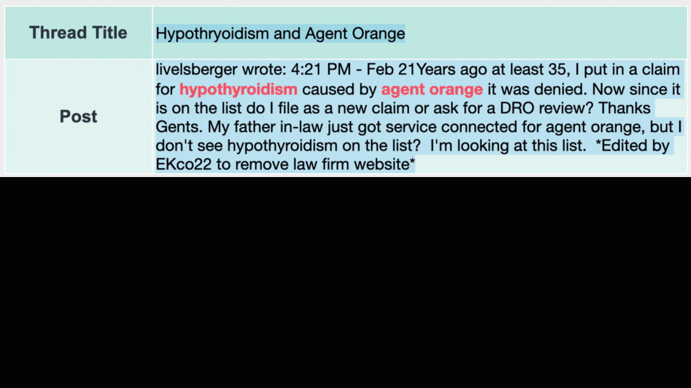

# project_05

# Understanding Activity on VetsBenefits.net

This effort looks at roughly 8,000 posts, ranging in size from 1-2 sentences, up to 1 or more paragraphs, on VetsBenefits.net.  VetsBenefits.net is a web forum where Veterans can ask questions about Veterans Benefits Administration (VBA) benefit programs, and get support for issues they may be experiencing navigating different benefits. The site is broken out into multiple sub-pages, each with 1 or more threads (a thread being a user-initiated topic for discussion), and each of those with one or more subsequent replies.

## Description and Data Used

Data was collected for the 500 most recently active threads. Active threads consisted mostly of January through March, although some threads maintained activity going back one or more years. To ensure more consistent and manageable data analysis and comparisons for weeks, data going back to September 2019 was selected to provide roughly 6 months of pre-Covid data, as well as capture activity during the pandemic.

## Overall Outcome

*Anchoring on several different areas including Covid, Disability & Appeals, Mental Health, the Aid & Attendance program, and Sleep related issues, CorEx topic modeling identified 5 additional topics for further investigation.*

## Approach

Data was vectorized via Countvectorizer, along with additional analysis of bigrams to identify potential topics to feed the CorEx model. 

This data was then used to identify the topics listed above, supporting further investigation into areas of interest, as well as enable time series investigations. 

Data was also collected and used to analyze cosine distance and make recommendations for similar posts. For example, looking for posts related to diabetes reveals potentially similar issues around Hypothyroidism, as well as other chronic ailments facing Veterans. 

## Tools & Techniques Used

#### *For Data Collection and EDA:*
* Plotly
* Matplotlib
* Seaborn
* Python Jupyter Notebook
* Pandas and Numpy

#### *For Matrix Factorization, Topic Modeling, and Post Similarity Analysis*
* CorEx
* Scikit-Learn NMF
* Countvectorizer
* Cosine Distance

#### *For Visualization*
* Streamlit

## Workbooks
* File0 - Data Acquisition: Data collection via Beautiful soup, traversing the landing page and then all thread sub-pages. Includes two files, one for collecting data in a tabular format, another for populating dictionaries. The latter is intended to be used for subsequent analysis.
* File1 - EDA: Analysis via Plotly and other visualization tools to identify trends in user-identified threads and general focus areas. 
* File2 - CorEx Topic Modeling: Including the final model using 5 anchor topics and 5 floating. 
* File3 - Similar Post Finder: Cosine-distance based tool to identify similar texts, posts and key words/phrases. 
* Scratch Notebooks: Includes additional EDA efforts, and several iterations of the the CorEx model, with different weights for key terms, as well as additional highlights in terms of specific benefit types. 

## Analysis Limitations

* **Limited to active threads.** As this is not yet being updated on a daily basis, data remains static. Additional insights into previous longer term trends were limited. 
* **No daily refresh.** In future, the tool will be continously updated and all plots refreshed to show how trends have changed and emerged over time. 

## Possible Impacts & Future Efforts

This can assist with identifying those issues Veterans may be facing and find require additional support to ensure ready access to benefits.  

#### *Future Efforts:*
Create cron job to update data on daily basis and complete back-end infrastructure build to collect user inputs (for search terms) and track ongoing data updates within a NoSQL database. 
